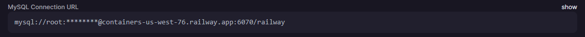

<h1>Cargon Rest API - Murilo Santos</h1>

API Restful usando Node.js, Express, Prisma e MySQL

Fiz uma outra versão da API utilizando MongoDB e Mongoose (ODM): https://github.com/muhhx/Cargon-MongoDB

## Como executar o projeto
Crie um banco de dados MySql no Railway e copie o "MySQL Connection URL" (Também é possível rodar de maneira local)
<h4 align="center">
  
</h4>

Após fazer isso, execute os seguintes comandos:
```
# Clonar o repositório
$ git clone https://github.com/muhhx/Cargon

# CD para o arquivo
$ cd Cargon
```

Crie um arquivo .env e substitua o campo "DATABASE_URL" com a url de acesso ao seu banco de dados do Railway
```
DATABASE_URL=SUA URL RAILWAY
```
Por ultimo, execute os seguintes comandos:

```
# Instale as dependencias
$ npm install

# Faça o migration do Prisma
$ prisma migrate dev --name init

# Execute o script
$ npm run dev

# API estará rodando em http://localhost:5000
```
  

## Ferramentas principais
- [Typescript](https://www.typescriptlang.org/) | Code
- [Express](https://expressjs.com/) | Framework para Node
- [Prisma](https://www.prisma.io/) | ORM
- [Railway](https://railway.app/) | Cloud para database
- [MySQL](https://www.mysql.com/) | Database
- [Bcrypt](https://www.npmjs.com/package/bcrypt) | Password encryption


## API endpoints

- **Criar usuário**
> http://localhost:5000/user/create

| ENDPOINT | METHOD | Body | URL Params | Success Status | Error Status              |
| -------- | :----: | ---- | :--------: | ---------------- | --------------------------- |
| /user/create | POST    | {</br>name: string,</br>email: string</br>password: string</br>}      | -          | **201** - CREATED</br>          | **500** - INTERNAL SERVER ERROR </br></br> or </br></br> **400** - BAD REQUEST </br></br> or </br></br> **409** - CONFLICT |

- **Acessar usuários**
> http://localhost:5000/users

| ENDPOINT | METHOD | Body | URL Params | Success Status | Error Status              |
| -------- | :----: | ---- | :--------: | ---------------- | --------------------------- |
| /users | GET    | -      | -         | **200** - OK</br> </br>*!Senha dos usuários não é retornada*        | **500** - INTERNAL SERVER ERROR |

## User Model
- **id:** unique identifier
- **name:** Nome do usuário
- **email:** Email do usuário (único)
- **password:** Senha do usuário (encriptado)
- **created_at:** Data de criação
- **updated_at:** Data do ultimo update

```
{
  id         Int      @id @default(autoincrement())
  email      String   @unique @db.VarChar(255)
  name       String
  password   String
  created_at DateTime @default(now())
  updated_at DateTime @updatedAt
}
```


<h4 align="center">Murilo Santos, 2022.✨™</h4>
